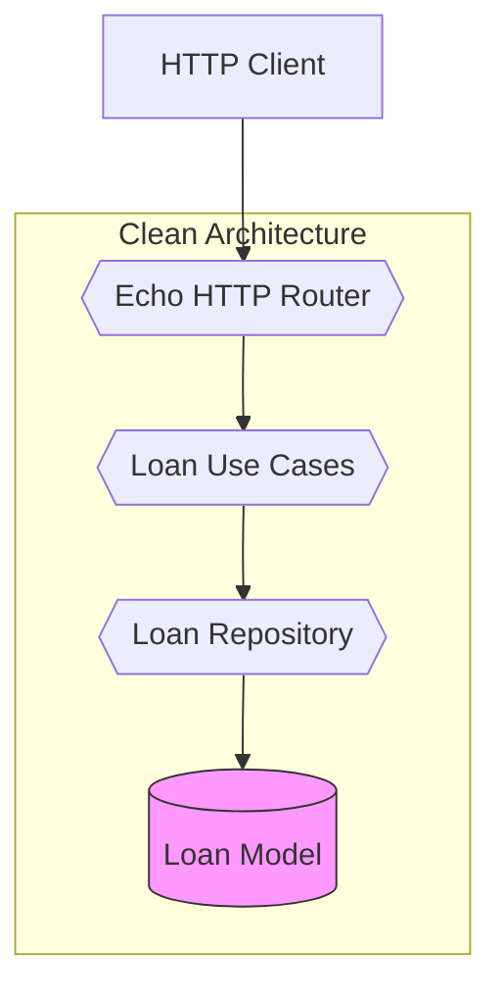
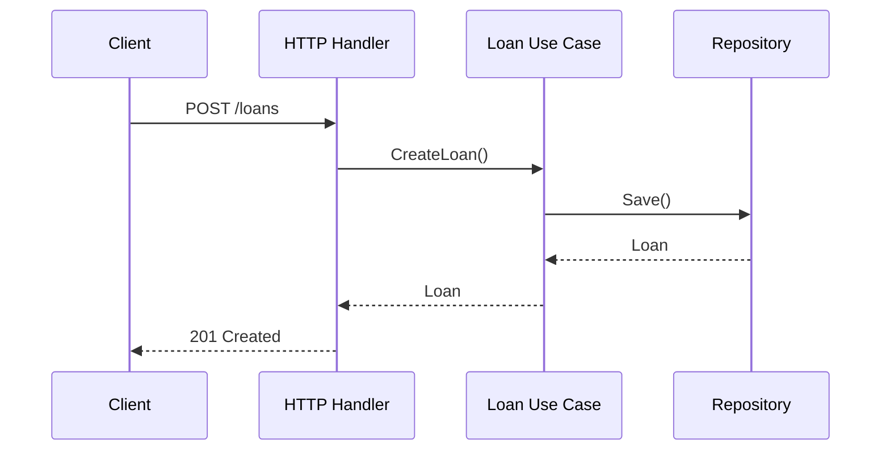

# Loan Management System

## Architecture Overview



## Core Components

### Loan State Machine

```mermaid
stateDiagram-v2
    [*] --> Proposed
    Proposed --> Approved: Admin Approval
    Approved --> Invested: Full Funding
    Invested --> Disbursed: Payout
    Disbursed --> [*]
    
    state Proposed {
        Entry: Validate borrower info
    }
    state Approved {
        Entry: Set approval metadata
    }
    state Invested {
        Entry: Track investments
    }
```

## Key Packages

| Package | Responsibility |
|---------|----------------|
| `internal/model` | Domain entities and business rules |
| `internal/usecase` | Business transaction orchestration |
| `internal/repository` | Data persistence (memory implementation) |
| `internal/delivery/http` | Echo web handlers and routes |

## Sequence Flow



## Development Setup

```bash
# Install dependencies
go mod tidy

# Run service
go run main.go
```

## Testing

```bash
# Run all tests with coverage
go test -cover ./...
```
