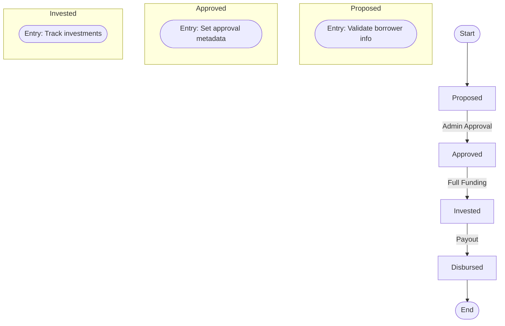
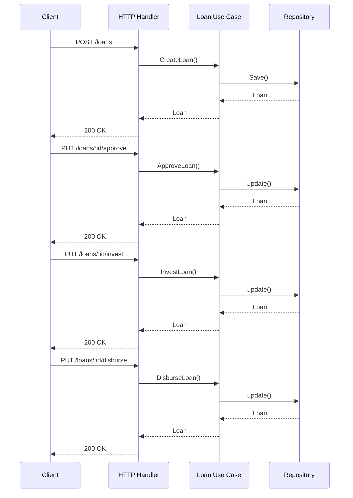

# Loan Management System

## Architecture Overview


## Core Components

### Loan State Machine



## Key Packages

| Package | Responsibility |
|---------|----------------|
| `internal/model` | Domain entities and business rules |
| `internal/usecase` | Business transaction orchestration |
| `internal/repository` | Data persistence (memory implementation) |
| `internal/delivery/http` | Echo web handlers and routes |

## Sequence Flow



## Development Setup

```bash
# Install dependencies
go mod tidy

# Run service
go run main.go
```

## Testing

```bash
# Run all tests with coverage
go test -cover ./...
```
